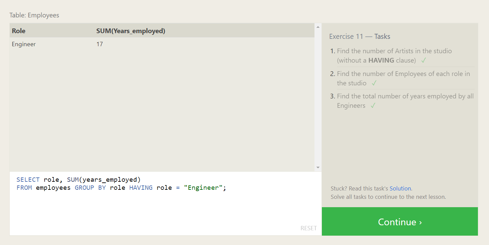

# **MySQL Task**

# **MySQL**

+ MySQL is widely used in the **Relational Database Management System (RDBMS)**.
+ MySQL  is **free and open source**.
+ MySQL is ideal for **both small and large applications**.
+ MySQL is **very fast, reliable, scalable and easy to use**.
+ MySQL is **database**.
+ The data in MySQL is stored in **database object** is called **tables**.

# **SQL**

+ SQL stands for **Structured Query Language**.
+ SQL can **access and manipulate database**.
+ SQL can **insert, update, delete, create, retrieve data, create new table** in a database.

## **_SQL Lesson 1: SELECT queries 101_**

### **_Exercise 1 — Tasks_**

1. Find the title of each film.
2. Find the director of each film.
3. Find the title and director of each film.
4. Find the title and year of each film.
5. Find all the information about each film.

## **_SQL Lesson 2: Queries with constraints (Pt. 1)_**

### **_Exercise 2 — Tasks_**

1. Find the movie with a row id of 6.
2. Find the movies released in the years between 2000 and 2010.
3. Find the movies not released in the years between 2000 and 2010.
4. Find the first 5 Pixar movies and their release year.

## **_SQL Lesson 3: Queries with constraints (Pt. 2)_**

### **_Exercise 3 — Tasks_**

1. Find all the Toy Story movies.
2. Find all the movies directed by John Lasseter.
3. Find all the movies (and director) not directed by John Lasseter.
4. Find all the WALL-* movies.

## **_SQL Lesson 4: Filtering and sorting Query results_**

### **_Exercise 4 — Tasks_**

1. List all directors of Pixar movies (alphabetically), without duplicates.
2. List the last four Pixar movies released (ordered from most recent to least).
3. List the first five Pixar movies sorted alphabetically.
4. List the next five Pixar movies sorted alphabetically.

## **_SQL Review: Simple SELECT Queries_**

### **_Review 1 — Tasks_**

1. List all the Canadian cities and their populations.
2. Order all the cities in the United States by their latitude from north to south.
3. List all the cities west of Chicago, ordered from west to east.
4. List the two largest cities in Mexico (by population).
5. List the third and fourth largest cities (by population) in the United States and their population.

## **_SQL Lesson 6: Multi-table queries with JOINs_**

### **_Exercise 6 — Tasks_**

1. Find the domestic and international sales for each movie.
2. Show the sales numbers for each movie that did better internationally rather than domestically.
3. List all the movies by their ratings in descending order.

## **_SQL Lesson 7: OUTER JOINs_**

### **_Exercise 7 — Tasks_**

1. Find the list of all buildings that have employees.
2. Find the list of all buildings and their capacity.
3. List all buildings and the distinct employee roles in each building (including empty buildings).

## **_SQL Lesson 8: A short note on NULLs_**

### **_Exercise 8 — Tasks_**

1. Find the name and role of all employees who have not been assigned to a building.
2. Find the names of the buildings that hold no employees.

## **_SQL Lesson 9: Queries with expressions_**

### **_Exercise 9 — Tasks_**

1. List all movies and their combined sales in millions of dollars.
2. List all movies and their ratings in percent.
3. List all movies that were released on even number years.

## **_SQL Lesson 10: Queries with aggregates (Pt. 1)_**

### **_Exercise 10 — Tasks_**

1. Find the longest time that an employee has been at the studio.
2. For each role, find the average number of years employed by employees in that role.
3. Find the total number of employee years worked in each building.

## **_SQL Lesson 11: Queries with aggregates (Pt. 2)_**

### **_Exercise 11 — Tasks_**

1. Find the number of Artists in the studio (without a HAVING clause).
2. Find the number of Employees of each role in the studio.
3. Find the total number of years employed by all Engineers.

## **_SQL Lesson 12: Order of execution of a Query_**

### **_Exercise 12 — Tasks_**
 
1. Find the number of movies each director has directed.
2. Find the total domestic and international sales that can be attributed to each director.

## **_SQL Lesson 13: Inserting rows_**

### **_Exercise 13 — Tasks_**

1. Add the studio's new production, Toy Story 4 to the list of movies (you can use any director).
2. Toy Story 4 has been released to critical acclaim! It had a rating of 8.7, and made 340 million domestically and 270 million internationally. Add the record to the BoxOffice table.

## **_SQL Lesson 14: Updating rows_**

### **_Exercise 14 — Tasks_**

1. The director for A Bug's Life is incorrect, it was actually directed by John Lasseter.
2. The year that Toy Story 2 was released is incorrect, it was actually released in 1999.
3. Both the title and director for Toy Story 8 is incorrect! The title should be "Toy Story 3" and it was directed by Lee Unkrich.

## **_SQL Lesson 15: Deleting rows_**

### **_Exercise 15 — Tasks_**

1. This database is getting too big, lets remove all movies that were released before 2005.
2. Andrew Stanton has also left the studio, so please remove all movies directed by him.

## **_SQL Lesson 16: Creating tables_**

### **_Exercise 16 — Tasks_**

1. Create a new table named Database with the following columns:
+ Name A string (text) describing the name of the database.
+ Version A number (floating point) of the latest version of this database.
+ Download_count An integer count of the number of times this database was downloaded.
- This table has no constraints.

## **_SQL Lesson 17: Altering tables_**

### **_Exercise 17 — Tasks_**

1. Add a column named Aspect_ratio with a FLOAT data type to store the aspect-ratio each movie was released in.
2. Add another column named Language with a TEXT data type to store the language that the movie was released in. Ensure that the default for this language is English.

## **_SQL Lesson 18: Dropping tables_**

### **_Exercise 18 — Tasks_**

1. We've sadly reached the end of our lessons, lets clean up by removing the Movies table
2. And drop the BoxOffice table as well

